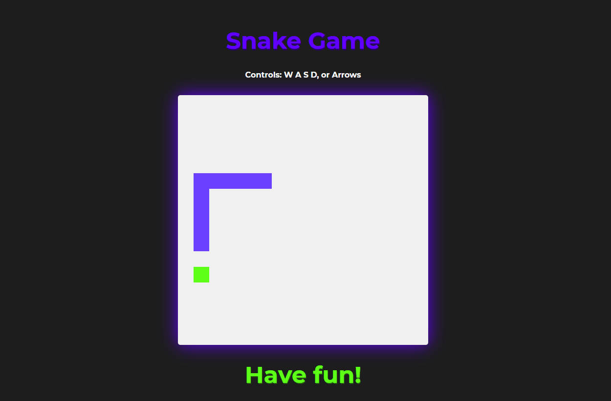

<h1 align="center">🐍 <b>Snake Game</b> 🐍</h1>

<h2>📜 Sobre o projeto:</h2>

O Clássico jogo da cobrinha feito em HTML, CSS e JavaScript puro.  
Mudanças do projeto original: <b>Visual, controladores [W,A,S,D] e automatização da reinicialização do jogo.</b> 
Projeto feito seguindo o passo a passo da <a href="https://github.com/SpruceGabriela">Gabriela Pinheiro</a> na <a href="https://digitalinnovation.one/">Digital Innovation One</a>

<h1 align="center">🚀 Como rodar o projeto 🚀</h1>

Clone o projeto ou baixe, inicialize o index.html
